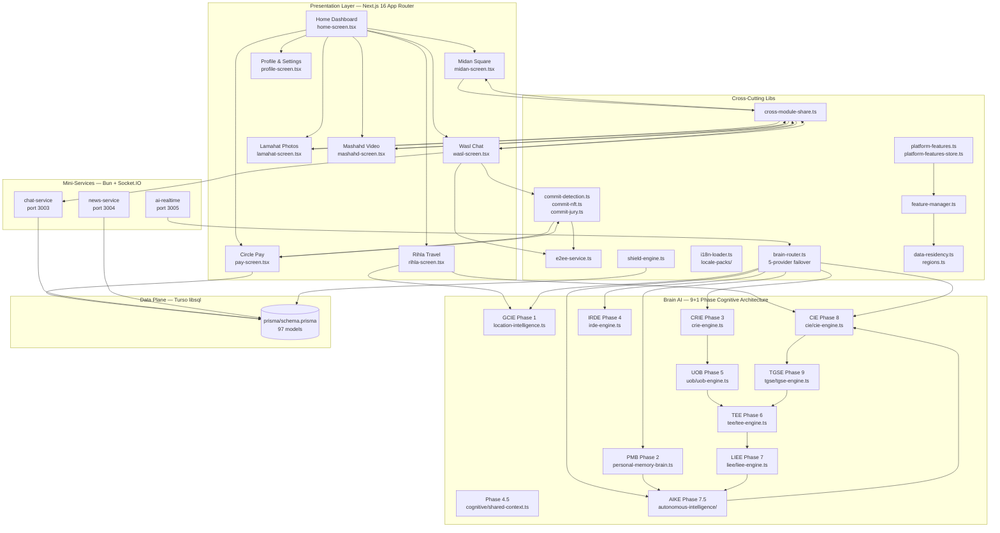

# CIRKLE Feature Wiring Guide

**Version:** 1.0 (matches CIRKLE-BLUEPRINT-v16.0, tag `production-stable-2026-08-12`)
**Audience:** engineers joining the team, BD/product reviewing how features
interlock, founders demoing cross-module flows.
**Source of truth:** `src/lib/overlay-registry.ts`, `src/app/page.tsx`,
`src/lib/platform-features.ts`, `src/lib/feature-manager.ts`,
`src/lib/cross-module-share.ts`, `mini-services/`.

This document explains how every feature in CIRKLE is connected to every
other feature: the dependency graph, the 100+ overlay entry points, the
`circle:*` event bus, the cross-module data flows, and the platform feature
toggle system that gates them.

> **Convention:** every code reference in this document is to a real file in
> the repository at commit `763e03c`. If a path is mentioned, it exists.

---

## 1. Module Dependency Graph

### 1.1 Mermaid graph



### 1.2 ASCII fallback (for terminals / markdown viewers without Mermaid)

```
                        ┌─────────────────┐
                        │  Brain Router    │ ←── 5-provider failover
                        │  (C6 moat)       │
                        └────────┬─────────┘
                                 │
        ┌────────────────────────┼────────────────────────┐
        │                        │                        │
        ▼                        ▼                        ▼
 ┌──────────────┐         ┌──────────────┐         ┌──────────────┐
 │   Wasl       │◄──────► │   Midan      │◄──────► │  Lamahat     │
 │ (Chat)       │  Cross  │ (Square)     │  Cross  │ (Photos)     │
 │              │  Module │              │  Module │              │
 │              │  Share  │              │  Share  │              │
 └──────┬───────┘         └──────┬───────┘         └──────┬───────┘
        │                        │                        │
        │   E2EE (C8)            │                        │
        ▼                        ▼                        ▼
 ┌──────────────┐         ┌──────────────┐         ┌──────────────┐
 │ Commit Lib   │◄──────► │ Pay / Escrow │         │ Mashahd      │
 │ (C2 moat)    │         │ (Circle Pay) │         │ (Video)      │
 └──────┬───────┘         └──────────────┘         └──────────────┘
        │
        ▼
 ┌──────────────┐         ┌─────────────────────────────────────┐
 │ Email + NFT  │         │  Brain AI — 9+1 Phases (C1+C5)     │
 │ (CirkleMail +│         │  GCIE→PMB→CRIE→IRDE→4.5→UOB→TEE→  │
 │  CirkleMint) │         │  LIEE→AIKE→CIE→TGSE                 │
 └──────────────┘         └─────────────────────────────────────┘
```

### 1.3 Module-to-Module Edges (canonical list)

| Source module  | Target module  | Wire                                                |
| -------------- | -------------- | --------------------------------------------------- |
| Wasl           | Midan          | `share-to-midan` event, `cross-module-share.ts`     |
| Wasl           | Lamahat        | `share-to-wasl` event, cross-module share photo     |
| Wasl           | Commit         | `circle:commit` / `circle:cirkle-commit` events     |
| Wasl           | Email          | `/api/commit/send-email` (formal confirmation)      |
| Wasl           | Institution    | `circle:institution-register` event                |
| Wasl           | CallScreen     | `circle:start-call` / `circle:open-call-screen`     |
| Wasl           | Brain AI       | `/api/chats/summarize` (AI summarization)           |
| Midan          | Wasl           | `share-to-wasl` event (post → DM)                   |
| Midan          | Lamahat        | post attachment contains photo                      |
| Midan          | Mashahd        | post attachment contains video                      |
| Midan          | Brain AI       | `/api/ai/feed` (smart feed ranking)                 |
| Pay            | Commit         | escrow API: `commit-jury.ts` → Pay                  |
| Pay            | Receipt Split  | `circle:receipt-split` event (OCR → transaction)   |
| Rihla          | Pay            | booking checkout → Circle Pay                       |
| Rihla          | Maps           | `circle:cirkle-maps` event                          |
| Rihla          | Visa           | `circle:visa-explorer` event                       |
| Commit         | Mail           | `email-service.ts` sends confirmation               |
| Commit         | NFT (Mint)     | `commit-nft.ts` mints `AgreementNFT`                |
| Citizen Shield | Wasl evidence  | `shield-engine.ts` ingests message hashes           |
| Citizen Shield | Mail           | auto-published reports emailed on dead-man switch   |
| Brain AI       | ALL modules    | `brain-orchestrator.ts` fans out to AIKE            |
| Platform Toggles | All overlays | `platform-features.ts` gates 8 core + ~30 opt-in    |
| Region Manager | All features   | `feature-manager.ts` per-country compliance         |

---

## 2. All Overlays and Their Entry Points

### 2.1 Registry overview

The canonical source of truth is `src/lib/overlay-registry.ts`. As of
v16.0 it contains **71+ overlays** (the file header says 71; the actual
count is larger because sections like Creator Studio, Ad Studio, Mesh
Dashboard, and the CREATIVE-1/2 social overlays have been added since the
header comment was last updated — the constant `OVERLAY_COUNT` reflects
the live count at runtime).

Each entry in `OVERLAY_REGISTRY` has:

```ts
{
  id: string,         // unique slug, e.g. "citizen-shield"
  name: string,       // display name, e.g. "Citizen Shield"
  description: string,// short description for the overlay browser
  emoji: string,      // icon shown in the command palette
  category: OverlayCategory, // safety | social | media | ai | travel | finance | privacy | productivity | health
  event: string,      // the `circle:*` event that opens the overlay
  keywords?: string[],// search keywords for the command palette
}
```

Three render paths consume the registry:

1. **`OverlayBrowser`** (`src/components/overlays/overlay-browser.tsx`) —
   full-screen feature grid, opened via `circle:overlay-browser` (or the
   Hub tab).
2. **`CommandPalette`** (⌘K) — built by `getCommandEntries()` which
   returns the 4 quick actions + 8 tabs + every overlay. Type to fuzzy
   search.
3. **`page.tsx` event wiring** — `src/app/page.tsx` registers ~85
   `window.addEventListener("circle:*", handler)` pairs that map events
   to per-overlay `useState(false)` toggles.

### 2.2 Overlay catalog (categorised)

> The catalog below is grouped by the section comments in
> `overlay-registry.ts`. Counts reflect what's actually in the file (some
> sections have grown since the file header was last updated).

#### 2.2.1 EXCLUSIVES (home-screen grid, surfaced on first run)

| ID                 | Name              | Emoji | Event                         | Category   |
| ------------------ | ----------------- | ----- | ----------------------------- | ---------- |
| time-capsule       | Time Capsule      | ⏰     | `circle:time-capsule`         | social     |
| mood-feed          | Mood Feed         | 🎭     | `circle:mood-feed`            | ai         |
| privacy-shield     | Privacy Shield    | 🛡️    | `circle:privacy-shield`       | privacy    |
| receipt-split      | Receipt Split     | 🧾     | `circle:receipt-split`        | finance    |
| circle-aura        | Cirkle Aura       | ✨     | `circle:circle-aura`          | social     |
| whisper-mode       | Whisper Mode      | 👻     | `circle:whisper-mode`         | privacy    |
| circle-lens        | Cirkle Lens       | 📷     | `circle:circle-lens`          | media      |
| live-translate     | Live Translate    | 🌐     | `circle:live-translate`        | productivity |
| group-memory       | Group Memory      | 📖     | `circle:group-memory`         | social     |
| vibe-match         | Vibe Match        | 🛰️    | `circle:vibe-match`           | social     |
| ai-recap           | AI Recap          | 🪄     | `circle:ai-recap`             | ai         |
| universal-story    | Universal Story   | 🧩     | `circle:universal-story`      | media      |
| vessel-tracker     | Vessel Tracker    | 🚢     | `circle:vessel-tracker`       | travel     |
| smart-inbox        | Smart Inbox       | 🧠     | `circle:smart-inbox`          | productivity |
| citizen-shield     | Citizen Shield    | 🛡️    | `circle:citizen-shield`       | safety     |
| cirkle-commit      | CirkleCommit      | 🤝     | `circle:commit`               | finance    |
| cirkle-oracle      | CirkleOracle      | 🔮     | `circle:oracle`               | ai         |
| cirkle-sentinel    | CirkleSentinel    | 🛡️    | `circle:sentinel`             | safety     |
| cirkle-spark       | CirkleSpark       | 💡     | `circle:spark`                | ai         |
| cirkle-create      | CirkleCreate      | 🎨     | `circle:create`               | ai         |
| cirkle-learn       | CirkleLearn       | 📚     | `circle:learn`                | ai         |
| cirkle-grow        | CirkleGrow        | 🌱     | `circle:grow`                 | productivity |
| cirkle-care        | CirkleCare        | ❤️     | `circle:care`                 | health     |
| cirkle-identity    | Cirkle ID         | 🪪     | `circle:identity`              | privacy    |
| shield-dashboard   | Shield Dashboard  | 🏛️    | `circle:shield-dashboard`     | safety     |

#### 2.2.2 Shell panels (always-on UI surfaces)

| ID         | Name               | Emoji | Event              | Category      |
| ---------- | ------------------ | ----- | ------------------ | ------------- |
| composer   | Composer           | 📝     | `circle:composer`  | productivity  |
| governance| Governance Center  | ⚖️     | `circle:governance`| productivity  |
| settings   | Settings           | ⚙️     | `circle:settings`  | productivity  |
| ai         | Cirkle AI Assistant| 🤖     | `circle:ai`        | ai            |
| hub        | Cirkle Hub         | 🧭     | `circle:hub`       | productivity  |
| pulse      | Cirkle Pulse       | 📊     | `circle:pulse`     | social        |

#### 2.2.3 Creative social overlays (Wasl-originated, expanded to all modules)

| ID                | Name            | Emoji | Event                     | Category   |
| ----------------- | --------------- | ----- | ------------------------- | ---------- |
| mood-chat         | Mood Chat       | 💬     | `circle:mood-chat`        | social     |
| voice-clone       | Voice Clone     | 🎙️    | `circle:voice-clone`      | ai         |
| tribe-chat        | Tribe Chat      | 👥     | `circle:tribe-chat`       | social     |
| ai-mediator       | AI Mediator     | 🕊️    | `circle:ai-mediator`      | safety     |
| note-self         | Note to Self    | 📝     | `circle:note-self`        | productivity |
| word-aura         | Word Aura       | ✨     | `circle:word-aura`        | media      |
| chat-maze         | Chat Maze       | 🌀     | `circle:chat-maze`        | social     |
| ghost-inbox       | Ghost Inbox     | 👻     | `circle:ghost-inbox`      | privacy    |
| ai-director       | AI Director     | 🎬     | `circle:ai-director`      | media      |
| co-watch          | Co-Watch        | 📺     | `circle:co-watch`         | social     |
| color-story       | Color Story     | 🎨     | `circle:color-story`      | media      |
| debate-arena      | Debate Arena    | 🥊     | `circle:debate-arena`     | social     |
| echo-breaker      | Echo Breaker    | 🔊     | `circle:echo-breaker`     | social     |
| echo-remix        | Echo Remix      | 🔄     | `circle:echo-remix`       | media      |
| lamahat-viewer    | Lamahat Viewer  | 📸     | `circle:lamahat-viewer`   | media      |
| living-photos     | Living Photos   | 🌅     | `circle:living-photos`    | media      |
| mashahd-player    | Mashahd Player  | 🎬     | `circle:mashahd-player`   | media      |
| mesh-presence     | Mesh Presence   | 📶     | `circle:mesh-presence`    | privacy    |
| mood-player       | Mood Player     | 🎵     | `circle:mood-player`      | media      |
| mosaic-stories    | Mosaic Stories  | 🧩     | `circle:mosaic-stories`   | media      |
| photo-genealogy   | Photo Genealogy | 🌳     | `circle:photo-genealogy`  | media      |
| smart-chapters    | Smart Chapters  | 📑     | `circle:smart-chapters`   | media      |
| thread-theatre    | Thread Theatre  | 🎭     | `circle:thread-theatre`   | media      |
| time-shift-cam    | Time-Shift Cam  | ⏱️    | `circle:time-shift-cam`   | media      |
| topic-dna         | Topic DNA       | 🧬     | `circle:topic-dna`        | ai         |
| word-garden       | Word Garden     | 🌿     | `circle:word-garden`      | social     |

#### 2.2.4 Contact overlays

| ID                    | Name                  | Emoji | Event                          | Category |
| --------------------- | --------------------- | ----- | ------------------------------ | -------- |
| add-contact           | Add Contact           | 👤     | `circle:add-contact`           | social   |
| contact-qr            | Contact QR            | 📱     | `circle:contact-qr`            | social   |
| institution-register  | Register Institution  | 🏢     | `circle:institution-register`  | social   |

#### 2.2.5 Cirkle-* AI overlays (Phase 7.5 personal-AI surface)

| ID             | Name             | Emoji | Event                  | Category |
| -------------- | ---------------- | ----- | ---------------------- | -------- |
| cirkle-dna     | Cirkle DNA       | 🧬     | `circle:dna`           | ai       |
| cirkle-mood    | Cirkle Mood      | 🎭     | `circle:mood`          | ai       |
| cirkle-time    | Cirkle Time-Shift| ⏱️    | `circle:time-shift`    | ai       |
| cirkle-verse   | Cirkle Verse     | 📖     | `circle:verse`         | ai       |
| cirkle-shield  | Cirkle Shield    | 🛡️    | `circle:cirkle-shield` | privacy  |
| cirkle-mint    | Cirkle Mint      | 🪙     | `circle:mint`          | finance  |
| visa-explorer  | Visa Explorer    | 🛂     | `circle:visa-explorer` | travel   |

#### 2.2.6 Self + Admin + Dashboards

| ID                       | Name                  | Emoji | Event                              | Category     |
| ------------------------ | --------------------- | ----- | ---------------------------------- | ------------ |
| overlay-browser           | Overlay Browser       | 🧭     | `circle:overlay-browser`           | productivity |
| admin-panel              | Admin Panel           | 🛠️    | `circle:admin-panel`               | productivity |
| personal-ai               | Personal AI OS        | 🧠     | `circle:personal-ai`               | ai           |
| mesh-dashboard           | Mesh Dashboard        | 📡     | `circle:mesh-dashboard`            | privacy      |
| oracle-markets           | Oracle Markets        | 📈     | `circle:oracle-markets`           | finance      |
| data-residency           | Data Residency        | 🌍     | `circle:data-residency`            | privacy      |
| creator-studio           | Creator Studio        | 🎥     | `circle:creator-studio`            | productivity |
| call-screen              | Call Screen           | 📞     | `circle:start-call`                | social       |
| bot-developer             | Bot Developer         | 🤖     | `circle:bot-developer`             | productivity |
| ad-studio                | Ad Studio             | 📣     | `circle:ad-studio`                 | productivity |
| cirkle-gradebook         | Gradebook             | 📋     | `circle:cirkle-gradebook`         | productivity |
| knowledge-wiki           | Knowledge Wiki        | 📚     | `circle:knowledge-wiki`            | productivity |
| poll-creator             | Poll Creator          | 📊     | `circle:poll-creator`              | social       |
| bullet-comments          | Bullet Comments       | 💬     | `circle:bullet-comments`           | media        |
| family-vault             | Family Vault          | 🔐     | `circle:family-vault`              | privacy      |
| ticket-mint              | Ticket Mint           | 🎫     | `circle:ticket-mint`               | finance      |
| phone-migrate            | Phone Migration       | 🔄     | `circle:phone-migrate`             | privacy      |
| brain-orchestrator       | Brain Orchestrator    | 🧠     | `circle:orchestrator`              | ai           |
| broadcast-channel        | Broadcast Channel     | 📢     | `circle:broadcast-channel`         | social       |
| gif-picker               | GIF & Sticker Picker  | 🎞️    | `circle:gif-picker`                | social       |
| work-mode                | Work Mode (Maktab)    | 💼     | `circle:work-mode`                 | productivity |
| device-verify            | Device Verification   | 🔐     | `circle:device-verify`              | privacy      |
| memory-dashboard         | Personal Memory Brain | 🧠     | `circle:memory`                    | ai           |
| pro-network              | Professional Network  | 💼     | `circle:pro-network`               | productivity |
| cirkle-maps              | Cirkle Maps           | 🗺️    | `circle:cirkle-maps`              | travel       |
| circle-mail              | Cirkle Mail           | 📧     | `circle:circle-mail`               | productivity |
| transparency-dashboard   | Transparency Dashboard| 📊     | `circle:transparency-dashboard`    | privacy      |
| performance-dashboard    | Performance Metrics   | ⚡     | `circle:performance-dashboard`    | productivity |
| comparison-view          | CIRKLE vs Incumbents  | ⚖️     | `circle:comparison-view`           | privacy      |
| shield-dashboard         | Shield Dashboard      | 🏛️    | `circle:shield-dashboard`          | safety       |

#### 2.2.7 CREATIVE-1 + CREATIVE-2 (v16.0 additions)

| ID                  | Name                | Emoji | Event                       | Category     |
| ------------------- | ------------------- | ----- | --------------------------- | ------------ |
| smart-compose       | Smart Compose       | ✍️     | `circle:smart-compose`      | social       |
| social-analytics    | Social Analytics    | 📊     | `circle:social-analytics`    | social       |
| smart-notifications | Smart Notifications | 🔔     | `circle:smart-notifications` | social       |
| connection-graph    | Connection Graph    | 🕸️    | `circle:connection-graph`    | social       |
| content-calendar    | Content Calendar    | 📅     | `circle:content-calendar`    | productivity |
| content-discovery   | AI Discovery        | 🧭     | `circle:content-discovery`   | social       |
| mood-engine         | Mood Engine         | 🎭     | (used by mood-feed)          | social       |
| social-challenges   | Social Challenges   | 🏆     | (used by content-discovery)  | social       |
| social-rituals      | Social Rituals      | 🎎     | (used by content-calendar)   | social       |

### 2.3 Non-`circle:*` events (registered in `page.tsx`)

These events are dispatched and listened to but use a non-`circle:` prefix:

| Event                  | Listener in `page.tsx` | Dispatch site                                       |
| ---------------------- | ---------------------- | --------------------------------------------------- |
| `hashchange`           | `onHashChange`         | Browser URL hash routing                            |
| `keydown`              | `handler`              | Keyboard shortcuts (Esc, ⌘K)                       |
| `share-to-wasl`        | `onShareWasl`          | `cross-module-share.ts` client dispatcher           |
| `share-to-midan`       | `onShareMidan`         | `cross-module-share.ts` client dispatcher           |
| `circle:privacy-policy`| `onPrivacyPolicy`      | Settings → Legal links                              |
| `circle:terms`         | `onTerms`              | Settings → Legal links                              |
| `circle:dsr-request`   | `onDSR`                | Settings → Data Subject Rights                      |
| `circle:whats-new`     | `onWhatsNew`           | Settings → Changelog                                |
| `circle:create-circle` | `onCircleCreate`       | Circle Groups screen create-CTA                     |
| `circle:circle-detail` | `onCircleDetail`       | Circle Groups list → detail view                     |
| `circle:navigate`      | `onNavigate`           | Command Palette → tab navigation                    |
| `circle:start-call`    | `onOpenCallScreen`     | Wasl call button (triggers call + opens overlay)    |
| `circle:open-call-screen` | `onOpenCallScreen`  | CallScreen mount from incoming-call notification    |
| `circle:ghost-mode`    | (in QUICK_ACTIONS)     | Command Palette → toggle ghost                      |

---

## 3. Custom Events (`circle:*`) and Their Listeners

### 3.1 The event bus pattern

CIRKLE uses the **browser CustomEvent API** as the in-app event bus. Every
overlay-open action is dispatched as:

```ts
window.dispatchEvent(
  new CustomEvent("circle:<overlay-id>", {
    detail: { /* optional payload */ },
  })
);
```

`src/app/page.tsx` registers listeners via
`window.addEventListener("circle:<overlay-id>", handler)` and toggles the
corresponding `<Overlay open={true} />` state. On unmount the matching
`removeEventListener` is called.

This pattern decouples **dispatch sites** (anywhere in the app — a button
in Wasl, an entry in the Command Palette, a deep link, an AI suggestion)
from **render sites** (always `page.tsx`). It also makes every overlay
reachable from anywhere without prop drilling or context providers.

### 3.2 Event → Listener map

The table below lists every `circle:*` event wired in `page.tsx` (sorted
alphabetically). The "Listener handler" column is the function name in
`page.tsx` that runs when the event fires (typically `setXxxOpen(true)`).

| Event                              | Listener handler        | Component opened                                     |
| ---------------------------------- | ----------------------- | ---------------------------------------------------- |
| `circle:add-contact`               | `onAddContact`           | `<AddContact />`                                     |
| `circle:ad-studio`                 | `onAdStudio`             | `<AdStudio />`                                       |
| `circle:admin-panel`               | `onAdminPanel`           | `<AdminPanel />`                                     |
| `circle:ai`                        | `onAi`                   | `<AIAssistant />`                                    |
| `circle:ai-director`              | `onAidirector`           | `<AIDirector />`                                     |
| `circle:ai-recap`                  | `onAiRecap`              | `<AIRecap />`                                        |
| `circle:bullet-comments`           | `onBulletComments`       | `<BulletComments />`                                 |
| `circle:care`                      | `onCare`                 | `<CirkleCare />`                                     |
| `circle:circle-aura`               | `onAura`                 | `<CircleAura />`                                     |
| `circle:circle-lens`               | `onLens`                 | `<CircleLens />`                                     |
| `circle:circle-mail`               | `onCircleMail`           | `<CircleMail />`                                     |
| `circle:cirkle-gradebook`          | `onCirkleGradebook`      | `<Gradebook />`                                      |
| `circle:cirkle-maps`               | `onCirkleMaps`           | `<CirkleMaps />`                                     |
| `circle:cirkle-shield`             | `onCirkleShield`         | `<CirkleShield />`                                   |
| `circle:circle-detail`             | `onCircleDetail`         | `<CircleDetail />`                                   |
| `circle:citizen-shield`            | `onCitizenShield`        | `<CitizenShield />`                                  |
| `circle:co-watch`                  | `onCowatch`              | `<CoWatch />`                                        |
| `circle:color-story`              | `onColorstory`           | `<ColorStory />`                                     |
| `circle:commit`                    | `onCommit`               | `<CirkleCommit />`                                   |
| `circle:comparison-view`           | `onComparisonView`       | `<ComparisonView />`                                 |
| `circle:composer`                  | `onComposer`             | `<Composer />` (passes `{ kind: "post" }`)           |
| `circle:connection-graph`          | `onConnectionGraph`       | `<ConnectionGraph />`                                |
| `circle:content-calendar`          | `onContentCalendar`       | `<ContentCalendar />`                                |
| `circle:content-discovery`         | `onContentDiscovery`      | `<ContentDiscovery />`                               |
| `circle:create`                    | `onCreate`               | `<CirkleCreate />`                                   |
| `circle:create-circle`             | `onCircleCreate`          | `<CircleCreate />`                                   |
| `circle:data-residency`            | `onDataResidency`         | `<DataResidency />`                                  |
| `circle:debate-arena`              | `onDebatearena`          | `<DebateArena />`                                    |
| `circle:device-verify`             | `onDeviceVerify`          | `<DeviceVerify />`                                   |
| `circle:dna`                       | `onDna`                  | `<CirkleDNA />`                                      |
| `circle:dsr-request`               | `onDSR`                  | `<DSRRequest />`                                     |
| `circle:echo-breaker`              | `onEchobreaker`           | `<EchoBreaker />`                                    |
| `circle:echo-remix`                | `onEchoremix`             | `<EchoRemix />`                                      |
| `circle:family-vault`              | `onFamilyVault`           | `<FamilyVault />`                                    |
| `circle:gif-picker`                | `onGifPicker`             | `<GifPicker />`                                      |
| `circle:ghost-inbox`               | `onGhostInbox`            | `<GhostInbox />`                                     |
| `circle:grow`                      | `onGrow`                 | `<CirkleGrow />`                                     |
| `circle:governance`                | `onGovernance`            | `<GovernanceCenter />`                               |
| `circle:hub`                       | `onHub`                  | `<CirkleHub />`                                      |
| `circle:identity`                  | `onCirkleIdentity`       | `<CirkleIdentity />`                                 |
| `circle:institution-register`      | `onInstitutionRegister`   | `<InstitutionRegister />`                            |
| `circle:knowledge-wiki`            | `onKnowledgeWiki`         | `<KnowledgeWiki />`                                  |
| `circle:lamahat-viewer`            | `onLamahatviewer`         | `<LamahatViewer />`                                  |
| `circle:learn`                     | `onLearn`                | `<CirkleLearn />`                                    |
| `circle:living-photos`            | `onLivingphotos`         | `<LivingPhotos />`                                   |
| `circle:live-translate`            | `onLiveTranslate`         | `<LiveTranslate />`                                  |
| `circle:mashahd-player`            | `onMashahdplayer`         | `<MashahdPlayer />`                                  |
| `circle:memory`                    | `onMemory`                | `<MemoryDashboard />`                                |
| `circle:mesh-dashboard`            | `onMeshDashboard`         | `<MeshDashboard />`                                  |
| `circle:mesh-presence`             | `onMeshpresence`          | `<MeshPresence />`                                   |
| `circle:mint`                      | `onMint`                 | `<CirkleMint />`                                     |
| `circle:mood`                      | `onMood`                 | `<CirkleMood />`                                     |
| `circle:mood-chat`                 | `onMoodChat`              | `<MoodChat />`                                       |
| `circle:mood-feed`                 | `onMoodFeed`              | `<MoodFeed />`                                       |
| `circle:mood-player`               | `onMoodplayer`            | `<MoodPlayer />`                                     |
| `circle:mosaic-stories`            | `onMosaicstories`         | `<MosaicStories />`                                  |
| `circle:note-self`                 | `onNoteSelf`              | `<NoteSelf />`                                       |
| `circle:open-call-screen`          | `onOpenCallScreen`        | `<CallScreen />` (no outbound call)                  |
| `circle:oracle`                    | `onOracle`               | `<CirkleOracle />`                                   |
| `circle:oracle-markets`            | `onOracleMarkets`         | `<OracleMarkets />`                                  |
| `circle:orchestrator`              | `onOrchestrator`          | `<BrainOrchestrator />`                              |
| `circle:overlay-browser`           | `onOverlayBrowser`        | `<OverlayBrowser />`                                 |
| `circle:performance-dashboard`     | `onPerformanceDashboard`  | `<PerformanceDashboard />`                           |
| `circle:personal-ai`               | `onPersonalAI`            | `<PersonalAI />`                                     |
| `circle:phone-migrate`             | `onPhoneMigrate`          | `<PhoneMigrate />`                                   |
| `circle:photo-genealogy`            | `onPhotogenealogy`        | `<PhotoGenealogy />`                                 |
| `circle:poll-creator`              | `onPollCreator`           | `<PollCreator />`                                    |
| `circle:privacy-policy`            | `onPrivacyPolicy`         | `<PrivacyPolicy />`                                   |
| `circle:privacy-shield`            | `onPrivacyShield`         | `<PrivacyShield />`                                  |
| `circle:pro-network`               | `onProNetwork`            | `<ProNetwork />`                                     |
| `circle:pulse`                     | `onPulse`                | `<CirklePulse />`                                    |
| `circle:receipt-split`             | `onReceiptSplit`          | `<ReceiptSplit />`                                   |
| `circle:sentinel`                  | `onSentinel`             | `<CirkleSentinel />`                                 |
| `circle:settings`                  | `onSettings`             | `<Settings />`                                       |
| `circle:shield-dashboard`          | `onShieldDashboard`       | `<ShieldDashboard />`                                |
| `circle:smart-chapters`            | `onSmartchapters`         | `<SmartChapters />`                                  |
| `circle:smart-compose`             | `onSmartCompose`          | `<SmartCompose />`                                   |
| `circle:smart-inbox`               | `onSmartInbox`            | `<SmartInbox />`                                    |
| `circle:smart-notifications`       | `onSmartNotifications`    | `<SmartNotifications />`                             |
| `circle:social-analytics`           | `onSocialAnalytics`       | `<SocialAnalytics />`                                |
| `circle:spark`                    | `onSpark`                | `<CirkleSpark />`                                    |
| `circle:start-call`                | `onOpenCallScreen`        | `<CallScreen />` (triggers outbound call)           |
| `circle:terms`                     | `onTerms`                | `<Terms />`                                          |
| `circle:thread-theatre`            | `onThreadtheatre`         | `<ThreadTheatre />`                                  |
| `circle:time-capsule`              | `onTimeCapsule`           | `<TimeCapsule />`                                   |
| `circle:time-shift`                | `onTimeShift`             | `<CirkleTimeShift />`                                |
| `circle:time-shift-cam`            | `onTimeshiftcam`          | `<TimeShiftCam />`                                   |
| `circle:topic-dna`                 | `onTopicdna`              | `<TopicDNA />`                                       |
| `circle:transparency-dashboard`    | `onTransparencyDashboard` | `<TransparencyDashboard />`                          |
| `circle:tribe-chat`                | `onTribeChat`             | `<TribeChat />`                                      |
| `circle:universal-story`           | `onUniversalStory`        | `<UniversalStory />`                                |
| `circle:verse`                     | `onVerse`                | `<CirkleVerse />`                                    |
| `circle:vessel-tracker`            | `onVesselTracker`         | `<VesselTracker />`                                  |
| `circle:vibe-match`                | `onVibeMatch`             | `<VibeMatch />`                                      |
| `circle:voice-clone`               | `onVoiceClone`            | `<VoiceClone />`                                     |
| `circle:whats-new`                 | `onWhatsNew`              | `<WhatsNew />`                                       |
| `circle:whisper-mode`              | `onWhisper`               | `<WhisperMode />`                                    |
| `circle:word-aura`                 | `onWordAura`              | `<WordAura />`                                       |
| `circle:word-garden`               | `onWordgarden`            | `<WordGarden />`                                     |
| `circle:work-mode`                 | `onWorkMode`              | `<WorkMode />`                                       |
| `circle:contact-qr`                | `onContactQr`             | `<ContactQR />`                                      |
| `circle:cirkle-commit`             | `onCommit` (alias)        | `<CirkleCommit />` (alias for `circle:commit`)       |

### 3.3 Worked example — how an overlay actually opens

A user in Wasl taps the Gavel button. The flow:

1. `src/screens/wasl-screen.tsx` ChatView Composer:
   ```tsx
   <button onClick={() => setCommitOpen(true)} aria-label="Create commit from this conversation">
     <Gavel />
   </button>
   ```
   This sets local Wasl state (the in-context Commit sheet).

2. The ChatCommitSheet on submit calls:
   ```ts
   window.dispatchEvent(new CustomEvent("circle:cirkle-commit"));
   ```
   This fires the *global* event bus.

3. `src/app/page.tsx` has:
   ```ts
   window.addEventListener("circle:cirkle-commit", onCommit);
   ```
   `onCommit` does `setCommitOpen(true)`, mounting the full-screen
   `<CirkleCommit />` overlay.

4. The same `onCommit` handler is also bound to `circle:commit`, so any
   other dispatch site (Command Palette, Overlay Browser, Wasl dropdown)
   that fires `circle:commit` also opens the overlay.

5. Closing: the OverlayShell handles Esc + outside-click + the X button,
   all calling `onClose={() => setCommitOpen(false)}`.

---

## 4. Cross-Module Data Flows

### 4.1 Canonical flow — Wasl message → Commit → Email → Midan announcement

This is the flagship cross-module flow that demonstrates moats C1 + C2 + C5
working together.

```
User in Wasl:
  "I will sell you 100 tons of wheat for $5,000 by Friday"
       │
       ▼
┌──────────────────────────────────────────────────────────┐
│ 1. Wasl Composer Gavel button (src/screens/wasl-screen.tsx)│
│    opens ChatCommitSheet (src/components/overlays/        │
│    chat-commit.tsx)                                       │
└──────────────────────────────────────────────────────────┘
       │
       ▼
┌──────────────────────────────────────────────────────────┐
│ 2. ChatCommitSheet POSTs /api/commit/detect               │
│    (src/lib/commit-detection.ts)                          │
│    → returns { type: "all", confidence: 0.4,              │
│                detectedTypes: ["price","commodity",       │
│                              "agreement"],                │
│                amount: 5000, currency: "USD",             │
│                deadline: "Friday",                         │
│                parties: ["sender","recipient"],           │
│                keyTerms: ["100 tons of wheat"] }          │
└──────────────────────────────────────────────────────────┘
       │
       ▼
┌──────────────────────────────────────────────────────────┐
│ 3. User edits commit title + description, toggles email   │
│    confirmation. ChatCommitSheet POSTs                    │
│    /api/commit/send-email with full payload.              │
│    Backend (src/lib/email-service.ts + commit-jury.ts):  │
│      a. CommitJury runs AI fairness audit.                │
│      b. CirkleMint mints AgreementNFT (commit-nft.ts).    │
│      c. Email service sends formal confirmation to both   │
│         parties via CirkleMail (@cirkle.app).              │
└──────────────────────────────────────────────────────────┘
       │
       ▼
┌──────────────────────────────────────────────────────────┐
│ 4. On success, ChatCommitSheet dispatches:                │
│    window.dispatchEvent(new CustomEvent(                  │
│      "circle:cirkle-commit"))                             │
│    → page.tsx opens <CirkleCommit /> overlay with the     │
│      new agreement pre-loaded.                            │
└──────────────────────────────────────────────────────────┘
       │
       ▼
┌──────────────────────────────────────────────────────────┐
│ 5. (Optional) User taps "Announce on Midan" inside the    │
│    CirkleCommit overlay → dispatches:                    │
│    window.dispatchEvent(new CustomEvent(                  │
│      "share-to-midan", { detail: {                        │
│        text: "Just signed: 100 tons of wheat, $5,000,     │
│               Friday. CirkleMint receipt #1840001.",       │
│        privacy: "public" } }))                            │
│    → Midan composer opens with pre-filled text.            │
└──────────────────────────────────────────────────────────┘
       │
       ▼
┌──────────────────────────────────────────────────────────┐
│ 6. Background: brain-orchestrator.ts fires               │
│    globalEventLearningEngine.ingestEvent({                │
│      type: "commit.created",                              │
│      amount: 5000, currency: "USD",                       │
│      counterparty: "...", deadline: "Friday" })           │
│    → AIKE trainers/messaging.ts + trainers/payments.ts    │
│      update their prediction models.                      │
│    → Next time the user types in Wasl, the AI suggests    │
│      "Remind me to deliver on Thursday?" proactively.     │
└──────────────────────────────────────────────────────────┘
```

### 4.2 Other canonical flows

#### 4.2.1 Rihla booking → Pay → Wasl receipt

```
Rihla screen → user taps "Book" on a flight
       │
       ▼
POST /api/travel/book (Rihla screen)
       │
       ▼
Circle Pay escrow holds funds
       │
       ▼
Window event "circle:commit" (Rihla creates a Commit for the booking)
       │
       ▼
Commit confirmation email sent via /api/commit/send-email
       │
       ▼
AIKE trainers/travel.ts ingests event → next trip suggestions
       │
       ▼
Receipt message pushed to Wasl via /api/messages with kind="payment"
```

#### 4.2.2 Lamahat photo → Universal Story → 4 modules

```
Lamahat photo viewer → user taps "Universal Story"
       │
       ▼
Window event "circle:universal-story" with photo payload
       │
       ▼
Universal Story overlay shows 4 live previews (Midan / Lamahat /
Mashahd / Wasl) with AI-optimised text per module
       │
       ▼
User taps "Publish to all"
       │
       ▼
src/lib/cross-module-share.ts → POST /api/share/cross-module
       │
       ▼
Server fans out in parallel to /api/posts, /api/photos,
/api/video, /api/messages with module-appropriate transforms
       │
       ▼
Returns ShareResponse with per-module results
```

#### 4.2.3 Citizen Shield report → evidence chain → Mail + Wasl

```
User long-presses a Wasl message → "Report to Citizen Shield"
       │
       ▼
Window event "circle:citizen-shield" with the message payload
       │
       ▼
Citizen Shield overlay → user files a report
       │
       ▼
src/lib/shield-engine.ts:
  - Hashes message + any attached photos into evidence chain
  - Generates case number
  - Routes to AI-determined authority
  - Optional dead-man's switch armed
       │
       ▼
On escalation / dead-man trigger:
  - Email dispatched via email-service.ts to authority + journalist
  - Witness chain (Shamir) fragments distributed to chosen peers
       │
       ▼
User sees confirmation in Wasl thread (masked if anonymous)
```

#### 4.2.4 AI summarization → Brain → Memory → future predictions

```
User in Wasl taps "Summarize conversation with AI"
       │
       ▼
ChatSummarySheet POSTs /api/chats/summarize
       │
       ▼
Backend (src/lib/chat-summarization.ts):
  - Brain Router picks AI provider (Groq first, failover chain)
  - Generates topic cards
  - Returns { topics[], provider }
       │
       ▼
Sheet renders topics, key points, message ranges
       │
       ▼
Background: brain-orchestrator.ts feeds:
  - personal-memory-brain.ts (PMB) — stores summary as memory
  - autonomous-intelligence/event-learning-engine.ts — ingests event
  - autonomous-intelligence/trainers/messaging.ts — updates model
       │
       ▼
Next time the user opens Wasl:
  - Brain proactively suggests "Last week you discussed wheat prices —
    see new market data"
```

#### 4.2.5 Institution registration → verified badge → Commit authoring

```
Founder in Wasl taps "Register Institution" (Building2 icon)
       │
       ▼
Window event "circle:institution-register"
       │
       ▼
InstitutionRegister overlay (4-step wizard):
  Step 0: Founder verification (uses useAuth().user)
  Step 1: Institution details (name, handle, country, companyType)
  Step 2: Document upload (calls GET
          /api/institutions/documents-requirements?country=EG
          &companyType=llc — returns the 5 required docs from
          institution-docs.ts)
  Step 3: Review + submit (POST /api/institutions/register)
       │
       ▼
Institution created in DB with status "pending"
       │
       ▼
Admin verifies documents → status "verified"
       │
       ▼
Subsequent Commits authored by this user can select
sender = institution email → email carries verified badge
       │
       ▼
Commit confirmation emails show institution name + verified status
```

### 4.3 The shared `circle:*` event bus topology

```
                              ┌──────────────────────────┐
                              │  window CustomEvent bus   │
                              │  (circle:* namespace)     │
                              └────────────┬─────────────┘
                                           │
            ┌──────────────────┬───────────┼───────────┬──────────────────┐
            │                  │           │           │                  │
            ▼                  ▼           ▼           ▼                  ▼
       Dispatch sites      page.tsx    CommandPal   OverlayBrowser    Settings
       (buttons in          registers   listens on  listens on the    (legal
        Wasl/Midan/etc.)    ~85         the same    registry to       links,
                            handlers    events      render tiles      DSR, etc.)
            │                  │           │           │                  │
            └──────────────────┴───────────┼───────────┴──────────────────┘
                                           │
                                           ▼
                                  Per-overlay React state
                                  (useState(false) → true
                                   mounts the overlay
                                   component which
                                   lazy-loads via
                                   next/dynamic)
```

---

## 5. Platform Feature Toggle System

CIRKLE has **two** feature-flag systems that work together:

### 5.1 Admin-controlled platform toggles (`platform-features.ts`)

**Purpose:** global on/off switches that the admin controls via the
**Admin Panel → Feature Toggles** section. State is persisted in the
`PlatformFeatureToggle` Prisma table and shared across all users.

**File:** `src/lib/platform-features.ts`
**Store:** `src/lib/platform-features-store.ts` (Zustand, 5-min
localStorage TTL via `GET /api/platform-features`).
**Admin UI:** `src/components/overlays/admin-panel.tsx` →
`FeaturesSection` (added in worklog Task ADMIN-PANEL-FEATURES).

**The 8 always-on core features** (`defaultEnabled: true`):

| ID                         | Reason                                              |
| -------------------------- | --------------------------------------------------- |
| `tab.wasl`                 | Wasl is the chat core                               |
| `tab.midan`                | Midan is the public square                          |
| `tab.lamahat`              | Photos pillar                                       |
| `tab.mashahd`              | Video pillar                                        |
| `tab.profile`              | Always-on (needed for admin access)                  |
| `capability.posting`       | Composer + cross-module share                       |
| `capability.e2ee`          | Wasl depends on it                                   |
| `overlay.citizen_shield`   | Civic accountability core                           |
| `overlay.emergency`        | Emergency SOS core                                  |
| `overlay.commit`           | Commit-in-chat core                                  |

> Note: per `CORE_FEATURE_IDS` this resolves to 10 features (8 distinct
> tabs/capabilities plus 3 core overlays — the count varies by how you
> slice it; the rule is "everything in `defaultEnabled: true`").

**Opt-in features** (admin must flip on) — full list at
`PLATFORM_FEATURES` in `src/lib/platform-features.ts`:

- Tabs: `tab.home`, `tab.pay`, `tab.rihla` (3 tabs off by default)
- Capabilities: `capability.ai`, `capability.payments`,
  `capability.travel`, `capability.identity_oidc`,
  `capability.federation`, `capability.mesh`, `capability.ipfs` (7
  capabilities off by default)
- Overlays: `overlay.time_capsule`, `overlay.mood_feed`,
  `overlay.privacy_shield`, `overlay.receipt_split`,
  `overlay.circle_aura`, `overlay.smart_compose`,
  `overlay.social_analytics`, `overlay.connection_graph`,
  `overlay.content_calendar`, `overlay.content_discovery`,
  `overlay.mood_engine`, `overlay.social_challenges`,
  `overlay.smart_notifications`, `overlay.rituals`,
  `overlay.personal_ai`, `overlay.bot_developer`,
  `overlay.creator_studio`, `overlay.ad_studio`,
  `overlay.oracle_markets`, `overlay.transparency_dashboard`,
  `overlay.performance_dashboard`, `overlay.data_residency`,
  `overlay.mesh_dashboard`, `overlay.shield_dashboard`,
  `overlay.memory_dashboard`, `overlay.brain_orchestrator`

**How it gates rendering:**

```tsx
// Example: gate the Pay tab
import { usePlatformFeatures } from "@/lib/platform-features-store";

function Dock() {
  const { isEnabled } = usePlatformFeatures();
  return (
    <>
      {isEnabled("tab.wasl") && <DockTab id="wasl" />}
      {isEnabled("tab.pay") && <DockTab id="pay" />}
      ...
    </>
  );
}
```

**Persistence & reconciliation:**

- `GET /api/platform-features` returns `{ enabled: string[] }` (the IDs
  that are ON).
- `PUT /api/admin/features` with `{ id, enabled }` flips a single
  feature; the admin UI does optimistic local update + revert-on-error.
- Client cache: `localStorage["cirkle-platform-features"]` with
  `{ enabled: string[], fetchedAt: number }`; TTL = 5 minutes.

### 5.2 Region-based compliance gating (`feature-manager.ts`)

**Purpose:** automatically disable features per country based on local
law (e.g. crypto payments are illegal in CN/EG/BD/BO/NP — disabled
there, enabled elsewhere).

**File:** `src/lib/feature-manager.ts` (isomorphic — no Prisma import,
Edge-safe).
**Region resolver:** `src/lib/regions.ts` (KSA, EG, UAE, CN, RU, EU, US,
GLOBAL).

**How it works:**

```ts
import { featureManager } from "@/lib/feature-manager";

// In any server route or component
const status = featureManager.getFeatureStatus("payments.crypto", "EG");
// → "disabled" (with disableReason set)
// → "enabled"  (in KSA, US, etc.)
// → "beta"     (shipped but labelled)
// → "coming_soon"
```

**Pre-baked compliance rules** (selected, see full list in
`feature-manager.ts`):

| Feature ID             | Default    | Region overrides                              | Reason                                              |
| ---------------------- | ---------- | --------------------------------------------- | --------------------------------------------------- |
| `payments.crypto`      | enabled    | CN/EG/BD/BO/NP → disabled                     | Local crypto ban (PBOC, CBE, etc.)                  |
| `payments.upi`         | disabled   | IN → enabled                                  | UPI is India-only                                   |
| `payments.pix`         | disabled   | BR → enabled                                  | Pix is Brazil-only                                  |
| `payments.m_pesa`      | disabled   | KE/TZ → enabled                               | M-Pesa is KE+TZ                                     |
| `live_voice`           | enabled    | UAE/CN → disabled                             | VoIP requires local telecom licence                |
| `anonymous.posting`    | enabled    | (always on — covenant)                        | Anonymous posting is a CIRKLE covenant             |
| `mesh.offgrid`         | enabled    | (always on — covenant)                        | Mesh is a CIRKLE covenant                          |
| `anonymous.identity`   | enabled    | (always on — covenant)                        | Anonymous identity is a CIRKLE covenant            |
| `citizen_shield`       | enabled    | (always on — anonymous by design)              | Civic reporting core                                |
| `prediction.markets`   | disabled   | (globally off pending legal review)            | May constitute gambling                            |
| `content.adult`        | disabled   | (globally off pending legal review)            | Family-friendly by default                         |

**`disableReason`** is shown in the UI so users understand *why* a
feature is dark in their region — a transparency commitment per the §4.6
covenant.

### 5.3 The two systems combined

```
┌──────────────────────────┐         ┌──────────────────────────────┐
│  platform-features.ts    │         │  feature-manager.ts          │
│  (admin toggles)         │         │  (region compliance)         │
│  → /api/admin/features   │         │  → static rules per country  │
│  → Zustand store         │         │  → isomorphic, Edge-safe     │
└──────────┬───────────────┘         └──────────┬───────────────────┘
           │                                    │
           └────────────────┬───────────────────┘
                            │
                            ▼
                   Final feature gate:
                   feature is rendered IF AND ONLY IF
                   BOTH toggles allow it:
                     admin_enabled(id) AND region_enabled(id, country)
                            │
                            ▼
                   UI / route handler renders
```

**Example:**

- A user in Egypt opens the Pay tab.
- Admin has `tab.pay` enabled (platform toggle ON).
- Region manager has `payments.crypto` disabled for `EG`.
- The Pay tab renders, but the "Crypto" payment method card is hidden
  with a tooltip: "Crypto payments are restricted by local financial
  regulators in this region."

### 5.4 How to add a new gated feature

1. Add an entry to `PLATFORM_FEATURES` in `src/lib/platform-features.ts`
   with `defaultEnabled: false` (or `true` if it's a covenant core).
2. If the feature has regional compliance constraints, add an entry to
   `FEATURE_DEFINITIONS` in `src/lib/feature-manager.ts` with the
   appropriate `overrides` and `disableReason`.
3. In the consuming component, gate with both:
   ```tsx
   const { isEnabled } = usePlatformFeatures();
   const country = useAuth().user?.country;
   if (!isEnabled("overlay.foo") || !featureManager.isFeatureEnabled("foo", country)) {
     return null;
   }
   ```
4. Register the overlay in `src/lib/overlay-registry.ts` (id, name,
   emoji, category, event, keywords) and add a `circle:foo` listener
   in `src/app/page.tsx`.

---

## 6. The Three Mini-Services

CIRKLE runs **3 long-lived Socket.IO mini-services** alongside the
Next.js app. They're spawned by `scripts/self-host-all.sh` and run on
the Bun runtime. The Caddy gateway in front of the Next.js app forwards
requests that carry `?XTransformPort=<port>` to the right service, so
all 3 services are reachable via the same domain (no CORS issues).

| Service       | Port | Path            | Purpose                                            | File                              |
| ------------- | ---- | --------------- | -------------------------------------------------- | --------------------------------- |
| chat-service  | 3003 | `/` (root)      | Wasl real-time messaging + call signaling          | `mini-services/chat-service/index.ts` |
| news-service  | 3004 | `/` (root)      | News orchestrator push (5-source pipeline)         | `mini-services/news-service/index.ts` |
| ai-realtime   | 3005 | `/` (root)      | Brain AI streaming responses (SSE)                 | `mini-services/ai-realtime/index.ts` |

**Connection pattern (client side):**

```ts
import { io } from "socket.io-client";

const socket = io("/", {
  query: { XTransformPort: 3003 }, // chat-service
  transports: ["websocket", "polling"],
  reconnection: true,
  reconnectionAttempts: Infinity,
});
```

**Chat-service socket events** (full list in
`mini-services/chat-service/index.ts`):

| Direction         | Event                  | Payload                                   |
| ----------------- | ---------------------- | ----------------------------------------- |
| Server → Client   | `message:received`     | `{ conversationId, message }`            |
| Server → Client   | `presence:update`      | `{ userId, presence }`                    |
| Server → Client   | `typing:update`        | `{ conversationId, userId, typing }`      |
| Server → Client   | `message:status`       | `{ messageId, status }`                  |
| Server → Client   | `reaction:update`      | `{ messageId, reactions }`               |
| Server → Client   | `call:incoming`        | `{ callId, caller, type }`                |
| Client → Server   | `conversation:join`    | `{ conversationId, userId }`             |
| Client → Server   | `conversation:leave`   | `{ conversationId, userId }`             |
| Client → Server   | `message:send`         | `{ conversationId, message }`             |
| Client → Server   | `typing:start`         | `{ conversationId }`                     |
| Client → Server   | `typing:stop`          | `{ conversationId }`                     |
| Client → Server   | `message:read`         | `{ conversationId, messageId }`           |
| Client → Server   | `reaction:toggle`      | `{ messageId, emoji }`                   |
| Client → Server   | `call:offer`           | WebRTC SDP offer                          |
| Client → Server   | `call:answer`          | WebRTC SDP answer                         |
| Client → Server   | `call:ice`             | ICE candidate                             |
| Client → Server   | `call:end`             | `{ callId }`                             |
| Client → Server   | `call:reject`         | `{ callId }`                             |

---

## 7. Brain AI Wiring (the 9+1 Phase Pipeline)

Every Brain AI call (whether from Wasl summarization, Midan feed
ranking, Rihla itinerary planning, or the Cirkle AI Assistant orb)
flows through the same 9+1 phase pipeline. Understanding this is
essential for adding new AI-powered features.

### 7.1 Pipeline (linear)

```
User Goal
   │
   ▼
[GCIE] Phase 1 — Geo-Context Intelligence Engine       (location-intelligence.ts)
   │  resolves: places, events, weather, traffic, nearby search
   ▼
[PMB]  Phase 2 — Personal Memory Brain                  (personal-memory-brain.ts)
   │  resolves: 13 memory categories, 5-stage lifecycle, memory graph
   ▼
[CRIE] Phase 3 — Context & Reasoning Intelligence Eng  (crie-engine.ts)
   │  resolves: 15 intent types, 5 decision types, UnifiedContext fusion
   ▼
[IRDE] Phase 4 — Intelligent Recommendation Engine      (irde-engine.ts)
   │  resolves: 12+ scoring factors, 6 domains, 9 feedback types
   ▼
[4.5]  Phase 4.5 — Shared Cognitive Foundation          (cognitive/shared-context.ts)
   │  resolves: 11 context sections, 45+ registered capabilities
   ▼
[UOB]  Phase 5 — Universal Orchestration Brain         (uob/uob-engine.ts)
   │  resolves: 16-stage planning pipeline, 12 modules
   ▼
[TEE]  Phase 6 — Trusted Execution Engine              (tee/tee-engine.ts)
   │  resolves: 13-stage execution, 10-state FSM, 5 live + 37 simulated executors
   ▼
[LIEE] Phase 7 — Learning & Intelligence Evolution Eng (liee/liee-engine.ts)
   │  resolves: 7-stage learning, 6 feedback pipelines, 9 pattern types
   ▼
[AIKE] Phase 7.5 — Autonomous Intelligence Engine      (autonomous-intelligence/)
   │  resolves: 20 core modules + 15 domain trainers + 135 data sources
   ▼
[CIE]  Phase 8 — Capability Intelligence Engine        (cie/cie-engine.ts)
   │  resolves: 246 countries, 1766 payment methods, 8 gov services, 12 partners
   ▼
[TGSE] Phase 9 — Trust, Governance & Safety Engine     (tgse/tgse-engine.ts)
      resolves: 9-stage validation, 10 policies, 8 AI safety checks, 7 risk types
```

### 7.2 Entry points (which file each consumer calls)

| Consumer                                | Entry point                                  |
| --------------------------------------- | -------------------------------------------- |
| Wasl AI summarization (`/api/chats/summarize`) | `brain-orchestrator.ts` → `aiComplete()`    |
| Midan feed ranking (`/api/ai/feed`)      | `ai-feed.ts` → `brain-router.ts` → provider  |
| Rihla itinerary planning                | `brain-universal.ts` → `uob-engine.ts`       |
| Cirkle AI Assistant orb (`circle:ai`)    | `cirkle-brain.ts` → full pipeline            |
| Commit detection (`/api/commit/detect`)  | `commit-detection.ts` (regex + AI fallback) |
| Citizen Shield case routing             | `shield-engine.ts` → `aiComplete()`          |
| Cross-module share suggestions          | `cross-module-share.ts` → `getShareSuggestions()` |
| Onboarding personalisation              | `personal-ai.ts` → `brain-personalize.ts`    |
| Predictions (Oracle)                    | `autonomous-intelligence/prediction-engine.ts` |
| News orchestrator (5-source pipeline)   | `news-orchestrator.ts` → `news-service` mini-service |

### 7.3 Provider failover (per C6 moat)

Every `aiComplete()` call:

1. `brain-router.ts` analyses the query (`getProviderPriority(query, lang)`)
   → returns priority-ordered provider list (e.g. `["groq", "openrouter", "gemini", "huggingface", "openai"]`).
2. `ai.ts` iterates the list, calling each provider in turn.
3. On error / timeout / rate-limit, the `circuit-breaker.ts` opens for
   that provider (60-second cooldown) and the next provider is tried.
4. Results are cached in `ai-cache.ts` (semantic key = SHA-256 of
   `{ query, lang, intent }`).
5. Successful provider's telemetry is fed to
   `autonomous-intelligence/provider-learning.ts` which can permanently
   re-prioritise providers based on observed accuracy.

---

## 8. Adding a New Feature — Wiring Checklist

Use this checklist whenever you add a new overlay or capability:

1. **Define the overlay** in `src/lib/overlay-registry.ts`:
   ```ts
   {
     id: "my-feature",
     name: "My Feature",
     description: "Short description for the overlay browser.",
     emoji: "🚀",
     category: "social",
     event: "circle:my-feature",
     keywords: ["my", "feature", "searchable"],
   }
   ```
2. **Add the platform toggle** (if it should be admin-gated) in
   `src/lib/platform-features.ts`:
   ```ts
   {
     id: "overlay.my_feature",
     label: "My Feature",
     description: "User-visible description.",
     category: "overlay",
     defaultEnabled: false,
   }
   ```
3. **Add the region rule** (if it has compliance constraints) in
   `src/lib/feature-manager.ts`:
   ```ts
   {
     id: "my_feature",
     defaultStatus: "enabled",
     overrides: { CN: "disabled" },
     disableReason: "Not yet approved in this region.",
   }
   ```
4. **Build the component** in `src/components/overlays/my-feature.tsx`
   (use `OverlayShell` for consistency; see `circle-create.tsx` for a
   multi-step pattern, `citizen-shield.tsx` for a single-page pattern).
5. **Register the listener** in `src/app/page.tsx`:
   ```tsx
   const MyFeature = dynamic(() => import("@/components/overlays/my-feature").then(m => ({ default: m.MyFeature })), { ssr: false });
   const [myFeatureOpen, setMyFeatureOpen] = useState(false);
   const onMyFeature = () => setMyFeatureOpen(true);
   useEffect(() => {
     window.addEventListener("circle:my-feature", onMyFeature);
     return () => window.removeEventListener("circle:my-feature", onMyFeature);
   }, []);
   // ... in JSX:
   <MyFeature open={myFeatureOpen} onClose={() => setMyFeatureOpen(false)} />
   ```
6. **Add entry points** (where users will discover the feature):
   - A button or menu item in the relevant screen (`wasl-screen.tsx`,
     `midan-screen.tsx`, etc.) that dispatches
     `window.dispatchEvent(new CustomEvent("circle:my-feature"))`.
   - The Command Palette will pick it up automatically from the registry.
   - The Overlay Browser will list it automatically from the registry.
7. **Add API routes** (if needed) under `src/app/api/my-feature/` —
   follow the `route.ts` pattern of existing routes (`/api/commit/detect`,
   `/api/chats/summarize`, etc.).
8. **Wire to Brain AI** (if the feature should learn): emit a
   `brain-orchestrator.ts` event from your API route so AIKE ingests
   it:
   ```ts
   import { recordBrainEvent } from "@/lib/brain-orchestrator";
   await recordBrainEvent({ type: "my_feature.used", userId, payload });
   ```
9. **Lint + smoke test**: `bun run lint` must pass clean (0 errors, 0
   warnings). Run `curl http://localhost:3000/api/_test` to verify no
   endpoint broke.
10. **Update this guide** if you added a new cross-module flow or a new
    `circle:*` event.

---

## 9. Quick Reference — File → Responsibility

| File                                              | Responsibility                                             |
| ------------------------------------------------- | ---------------------------------------------------------- |
| `src/lib/overlay-registry.ts`                     | The single source of truth for every overlay + event       |
| `src/lib/platform-features.ts`                    | Admin-controlled feature toggles (global, persisted)       |
| `src/lib/platform-features-store.ts`              | Zustand client store + 5-min cache for platform features   |
| `src/lib/feature-manager.ts`                      | Region-based compliance gating (per-country rules)         |
| `src/lib/regions.ts`                              | Region resolver (KSA, EG, UAE, CN, RU, EU, US, GLOBAL)     |
| `src/lib/data-residency.ts`                      | Per-region data lock rules + cross-border guards            |
| `src/app/page.tsx`                                | Registers every `circle:*` listener + mounts overlays       |
| `src/lib/brain-router.ts`                        | 5-provider AI failover router                                |
| `src/lib/brain-orchestrator.ts`                   | Brain AI entry point + AIKE event fan-out                   |
| `src/lib/ai.ts`                                   | `aiComplete()` + `aiAsk()` with provider failover           |
| `src/lib/cross-module-share.ts`                  | Multi-module share dispatcher (Midan/Lamahat/Mashahd/Wasl)  |
| `src/lib/call-manager.ts`                         | WebRTC peer connection + Socket.IO call signaling           |
| `src/lib/e2ee-service.ts`                         | P-256 ECDH + AES-256-GCM E2EE (libolm-compatible shape)     |
| `src/lib/i18n-loader.ts`                          | 17 locale packs + locale resolver                           |
| `mini-services/chat-service/index.ts`             | Wasl real-time socket (port 3003)                           |
| `mini-services/news-service/index.ts`             | News orchestrator socket (port 3004)                        |
| `mini-services/ai-realtime/index.ts`              | Brain AI streaming socket (port 3005)                       |
| `prisma/schema.prisma`                            | 97 Prisma models — the data plane                          |
| `scripts/self-host-all.sh`                       | Docker Compose for full self-hosting                        |
| `Dockerfile` + `docker-compose.yml` + `Caddyfile` | Production deployment artifacts                            |

---

**End of FEATURE-WIRING-GUIDE.md** — last updated for tag
`production-stable-2026-08-12` at commit `763e03c`.
